# 🏛️ CivicConnect - Municipality Management System


---

## 📋 Table of Contents

- [Overview](#overview)
- [System Architecture](#system-architecture)
- [Data Flow & User Journeys](#data-flow--user-journeys)
- [Tech Stack](#tech-stack)
- [Key Modules](#key-modules)
- [Installation & Setup](#installation--setup)
- [API Documentation](#api-documentation)
- [Contributing Guidelines](#contributing-guidelines)
- [License](#license)

---

## 📖 Overview

### Problem Statement

Traditional municipal management systems rely heavily on manual record-keeping, paper-based workflows, and fragmented data storage. This creates significant challenges:

- **Inefficiency**: Citizens must visit physical offices to lodge complaints, request certificates, or make payments
- **Lack of Transparency**: Limited access to service status and progress tracking
- **Data Fragmentation**: Information scattered across multiple departments and systems
- **Delayed Service Delivery**: Manual processing leads to extended turnaround times

### Solution: CivicConnect

**CivicConnect** is a comprehensive, digitized municipality management platform designed to:

✅ **Digitize & Centralize** all municipal services and records  
✅ **Empower Citizens** with 24/7 access to services and real-time status tracking  
✅ **Streamline Operations** for municipal employees with an intuitive admin dashboard  
✅ **Enhance Transparency** through integrated notification and feedback systems  
✅ **Enable Data-Driven Decisions** with analytics and reporting tools

### Target Audience

- **Citizens**: Access services, lodge complaints, and track status online
- **Municipal Employees**: Manage requests, process applications, and coordinate departments
- **System Administrators**: Monitor platform health, manage users, and configure system settings

---

## 🏗️ System Architecture

### High-Level Architecture

CivicConnect follows a **Modern Web Architecture** pattern:

- **Client Layer**: React.js-based responsive frontend
- **API Gateway**: Express.js backend with REST and WebSocket APIs
- **Business Logic Layer**: Controllers and services handling core functionality
- **Data Layer**: MongoDB for flexible document storage
- **External Integrations**: Firebase Authentication, Cloudinary CDN, Payment Gateways

### Architecture Diagram

```mermaid
graph TD
    A["🌐 Client Layer<br/>React.js + Vite + Tailwind"]
    B["🔐 API Gateway<br/>Express.js + CORS + Auth"]
    C["⚙️ Business Logic<br/>Controllers & Services"]
    D["🗄️ Data Layer<br/>MongoDB Atlas"]
    E["📡 Real-time<br/>Socket.IO"]
    F["☁️ External Services<br/>Firebase, Cloudinary<br/>Payment Gateway"]
    G["🤖 AI Integration<br/>Google Generative AI<br/>OpenAI"]
    H["📊 IoT Sensors<br/>Simulator & Real Devices"]

    A -->|REST/WebSocket| B
    B --> C
    C --> D
    B --> E
    C --> F
    C --> G
    B --> H

    style A fill:#e1f5ff
    style B fill:#fff3e0
    style C fill:#f3e5f5
    style D fill:#e8f5e9
    style E fill:#fce4ec
    style F fill:#fff9c4
    style G fill:#f1f8e9
    style H fill:#ede7f6
```



---

## 📊 Data Flow & User Journeys

### Critical Flow: Citizen Lodging a Public Grievance

A citizen's journey from filing a complaint to resolution:

```mermaid
sequenceDiagram
    participant Citizen as 👤 Citizen
    participant Frontend as 🖥️ Frontend App
    participant Backend as ⚙️ Backend Server
    participant Database as 🗄️ MongoDB
    participant Firebase as 🔐 Firebase
    participant NotifyService as 📬 Notification Service
    participant Admin as 👨‍💼 Admin Dashboard

    Citizen->>Frontend: Opens app & logs in
    Frontend->>Firebase: Authenticate user
    Firebase-->>Frontend: Token received

    Citizen->>Frontend: Fills complaint form
    Frontend->>Frontend: Validates data

    Citizen->>Frontend: Submits complaint
    Frontend->>Backend: POST /api/complaints
    Backend->>Firebase: Verify user token
    Firebase-->>Backend: Token valid

    Backend->>Database: Save complaint record
    Database-->>Backend: Complaint created (ID: #12345)
    Backend-->>Frontend: 201 Success + Complaint ID
    Frontend-->>Citizen: ✅ Complaint filed (Ref: #12345)

    Backend->>NotifyService: Trigger email notification
    NotifyService-->>Citizen: 📧 Email sent

    Admin->>Admin: Checks dashboard
    Backend->>Database: Query new complaints
    Database-->>Admin: Display complaint #12345

    Admin->>Backend: PUT /api/complaints/12345 (Status: In Progress)
    Backend->>Database: Update status
    Backend->>NotifyService: Notify citizen of status change
    NotifyService-->>Citizen: 📱 SMS/Email: Status updated

    Admin->>Admin: Resolves complaint
    Admin->>Backend: PUT /api/complaints/12345 (Status: Resolved)
    Backend->>Database: Update status + close date
    Backend->>NotifyService: Notify citizen of resolution
    NotifyService-->>Citizen: ✅ Complaint resolved

    Citizen->>Frontend: Views complaint status (Resolved)
    Frontend->>Backend: GET /api/complaints/12345
    Backend->>Database: Fetch complaint details
    Database-->>Frontend: Display resolution details
```



---

## 🛠️ Tech Stack

### Frontend Technologies

| Category             | Technology                      | Purpose                     |
| -------------------- | ------------------------------- | --------------------------- |
| **Framework**        | React.js 19.2.0                 | UI component library        |
| **Build Tool**       | Vite                            | Fast module bundler         |
| **Styling**          | Tailwind CSS 4.1.17             | Utility-first CSS framework |
| **Routing**          | React Router v7.9.6             | Client-side navigation      |
| **State Management** | React Hooks + React Query 5.9.0 | Data fetching & caching     |
| **Forms**            | React Hook Form 7.66.1          | Efficient form handling     |
| **Animation**        | Framer Motion 12.23.24          | Smooth UI animations        |
| **Icons**            | Lucide React 0.554.0            | SVG icon library            |
| **HTTP Client**      | Fetch API / TanStack Query      | REST API communication      |
| **Authentication**   | Firebase SDK 11.0.0             | User auth & secure tokens   |
| **Analytics**        | Vercel Analytics 1.5.0          | User behavior tracking      |
| **AI Integration**   | Google Generative AI 0.24.1     | Chatbot & AI features       |

### Backend Technologies

| Category                    | Technology                  | Purpose                       |
| --------------------------- | --------------------------- | ----------------------------- |
| **Framework**               | Express.js 4.21.1           | REST API & HTTP server        |
| **Runtime**                 | Node.js 20+                 | JavaScript runtime            |
| **Database**                | MongoDB 8.9.0 (Atlas)       | NoSQL document database       |
| **Authentication**          | Firebase Admin SDK 13.6.0   | Token verification & auth     |
| **Real-time Communication** | Socket.IO 4.8.1             | WebSocket for live chat       |
| **File Upload**             | Multer 2.0.2                | Handle file uploads           |
| **Image Storage**           | Cloudinary 2.8.0            | Cloud-based image CDN         |
| **Encryption**              | Bcrypt 6.0.0                | Password hashing              |
| **JWT**                     | jsonwebtoken 9.0.2          | Token generation & validation |
| **Environment Vars**        | Dotenv 16.6.1               | Configuration management      |
| **AI Integration**          | OpenAI 6.15.0               | Advanced AI features          |
| **Google AI**               | Google Generative AI        | Alternative AI model          |
| **IoT Simulation**          | Custom Simulator            | IoT sensor data generation    |
| **Error Handling**          | Express Async Handler 1.2.0 | Async error management        |
| **Metadata**                | Exifr 7.1.3                 | Photo metadata extraction     |

### DevOps & Infrastructure

| Category             | Technology        | Purpose                      |
| -------------------- | ----------------- | ---------------------------- |
| **Containerization** | Docker            | Application containerization |
| **Orchestration**    | Docker Compose    | Multi-container management   |
| **Reverse Proxy**    | Nginx             | Load balancing & routing     |
| **Database Hosting** | MongoDB Atlas     | Managed cloud database       |
| **Cloud Storage**    | Cloudinary        | Image CDN & optimization     |
| **Deployment**       | Vercel (Frontend) | Serverless frontend hosting  |
| **Development**      | Nodemon           | Auto-restart on file changes |

---

## 🎯 Key Modules

### 1. **Citizen Services Module**

- **Online Tax Payment**: Secure payment gateway integration
- **Certificate Issuance**: Birth, death, residence certificate requests
- **Service Requests**: General service inquiries and bookings
- **Status Tracking**: Real-time tracking of submitted requests
- **Digital Records**: Access to personal municipal records

### 2. **Public Grievance Redressal System**

- **Complaint Filing**: Multi-category complaint submission
- **Real-time Status Updates**: WebSocket-based live status notifications
- **Complaint Tracking**: Unique reference numbers and timeline view
- **Feedback System**: Post-resolution citizen feedback
- **Analytics Dashboard**: Complaint trends and resolution rates

### 3. **Admin Management Dashboard**

- **Request Management**: Review, approve, or reject citizen requests
- **User Management**: Add/remove users and manage roles
- **Department Coordination**: Assign tasks across departments
- **Analytics & Reporting**: Generate compliance and performance reports
- **System Configuration**: Manage fees, notification templates, and policies

### 4. **Real-time Chat System**

- **Live Support**: Direct messaging between citizens and support staff
- **WebSocket Integration**: Instant message delivery via Socket.IO
- **Chat History**: Persistent conversation storage
- **Notification System**: SMS and email alerts for new messages

### 5. **IoT Integration Module**

- **Sensor Data Collection**: Real-time data from environmental/traffic sensors
- **Simulator**: Development-mode sensor data generation
- **Live Dashboard**: Visualization of IoT metrics
- **Alerts**: Threshold-based anomaly detection

### 6. **AI-Powered Assistant**

- **Chatbot Support**: Natural language processing for FAQs
- **Complaint Categorization**: Automatic category assignment using AI
- **Document Analysis**: Intelligent form filling and data extraction
- **Recommendations**: Personalized service suggestions

### 7. **Media Management**

- **Image Upload & Storage**: Cloudinary integration for optimized storage
- **EXIF Data Extraction**: Photo metadata for records
- **Gallery Management**: Organized photo collection with search

---

## 🚀 Installation, Environment & Production setup

> Important: This project expects specific environment variable names in code — ensure you set them exactly (see _Environment variables_ below). Use a secrets manager for production instead of committing `.env` files.

### Dev prerequisites

- Node.js (v18+ recommended)
- npm or yarn
- MongoDB Atlas (or local instance)
- Git
- Docker (optional)

### Backend: quickstart

```bash
cd backend
npm install
# Create a .env file using the variables below
npm run dev  # runs nodemon server.js
```

Backend health check: `http://localhost:5000/health`

### Frontend: quickstart

```bash
cd frontend
npm install
# Create a .env with VITE_* variables
npm run dev
```

Frontend local: `http://localhost:3000`

### Docker (optional)

```bash
# From repository root
docker-compose up -d --build
```

---

## ⚙️ Environment variables (canonical — please follow these names)

Server-side env vars (key names used by code):

- `PORT` — Server port (default: 5000)
- `NODE_ENV` — environment (development|production)
- `CLIENT_URL` — allowed origin for CORS (frontend URL)
- `MONGO_URI` — MongoDB connection string (used by backend/config/db.js)
- `FIREBASE_SERVICE_ACCOUNT_JSON` — JSON string of Firebase service account (backend/config/firebaseAdmin.js parses this)
  - Example (Linux/macOS): `export FIREBASE_SERVICE_ACCOUNT_JSON=$(jq -c . ./firebase-service.json)`
  - For PowerShell: `$env:FIREBASE_SERVICE_ACCOUNT_JSON = Get-Content .\firebase-service.json -Raw`
- `JWT_SECRET` — JWT secret for tokens (if applicable)
- `JWT_EXPIRES_IN` — expiration for JWTs (e.g., 7d)
- `OPENAI_API_KEY`, `GEMINI_API_KEY`, `GROQ_API_KEY` — optional API keys
- `CLOUDINARY_CLOUD_NAME`, `CLOUDINARY_API_KEY`, `CLOUDINARY_API_SECRET` — for Cloudinary
- `S3_BUCKET`, `S3_ACCESS_KEY`, `S3_SECRET_KEY`, `S3_REGION` — optional S3

Frontend-side (Vite):

- `VITE_API_URL` — e.g., `http://localhost:5000/api`
- `VITE_FIREBASE_API_KEY`, `VITE_FIREBASE_AUTH_DOMAIN`, `VITE_FIREBASE_PROJECT_ID`, `VITE_FIREBASE_APP_ID` — Firebase client config

---

## 🔐 Production & security recommendations

- Use a secrets manager (Azure Key Vault, AWS Secrets Manager, GitHub Actions Secrets) for `FIREBASE_SERVICE_ACCOUNT_JSON` and API keys.
- Restrict network access to MongoDB (allow only app hosts or VPCs).
- Use HTTPS/TLS and HSTS for public endpoints.
- Monitor, log and configure alerting for errors and key metrics.

---

## 📦 Deployment guidance

- Frontend: build (`npm run build`) and deploy to Vercel/Netlify/GCP or your CDN
- Backend: run as Docker container behind a reverse proxy (Nginx) or host on managed containers
- Attach to MongoDB Atlas, configure backups and monitoring

---

## 🔧 Troubleshooting

- If backend fails to start: confirm `MONGO_URI` is set and accessible
- Firebase token verification errors: ensure `FIREBASE_SERVICE_ACCOUNT_JSON` is valid and has proper IAM roles
- CORS issues: confirm `CLIENT_URL` matches your front-end URL

---

## 🧾 Changelog (recent)

- **2026-01-05** — Aligned README to actual code usage: `MONGO_URI` and `FIREBASE_SERVICE_ACCOUNT_JSON` are the canonical env vars. Added production deployment guidance and security notes.

---

(End of updated installation & environment section)
